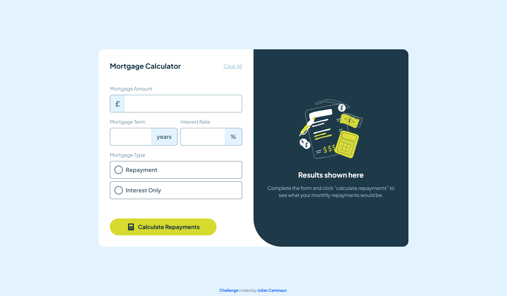

# Frontend Mentor - Mortgage repayment calculator solution

This is a solution to the [Mortgage repayment calculator challenge on Frontend Mentor](https://www.frontendmentor.io/challenges/mortgage-repayment-calculator-Galx1LXK73).

## Table of contents

- [Overview](#overview)
  - [The challenge](#the-challenge)
  - [My Solution](#my-solution)
    - [Desktop](#desktop)
    - [Mobile](#mobile)
  - [Links](#links)
- [My process](#my-process)
  - [Built with](#built-with)
  - [Useful resources](#useful-resources)
- [Author](#author)

## Overview

### The challenge

Your users should be able to:

- Input mortgage information and see monthly repayment and total repayment amounts after submitting the form
- See form validation messages if any field is incomplete
- Complete the form only using their keyboard
- View the optimal layout for the interface depending on their device's screen size
- See hover and focus states for all interactive elements on the page

### My Solution

#### Desktop

#### Mobile

### Links

- Live Site URL: [Live Site](https://caminaur-mortgage-challenge.netlify.app/)
- Solution Repository: [Github](https://github.com/Caminaur/Mortgage-Calculator)

## My process

### Built with

- React JS
- Tailwind
  First project I've done using Tailwind. It's very interesting. I believe it helped me improve the speed greatly.
  I am looking forward using it in future projects

### Useful resources

- [React](https://react.dev/reference/react)
- [Tailwind](https://tailwindcss.com/docs/)

## Author

- [Website](https://julian-caminaur.tech/)
- [Frontend Mentor](https://www.frontendmentor.io/profile/Caminaur)
- [CSS Battle](https://cssbattle.dev/player/caminaur)
- [Exercism](https://exercism.org/profiles/Caminaur)
